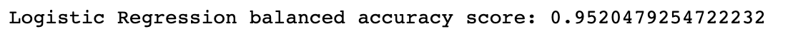
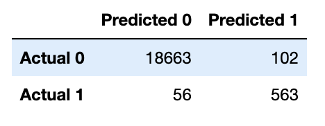
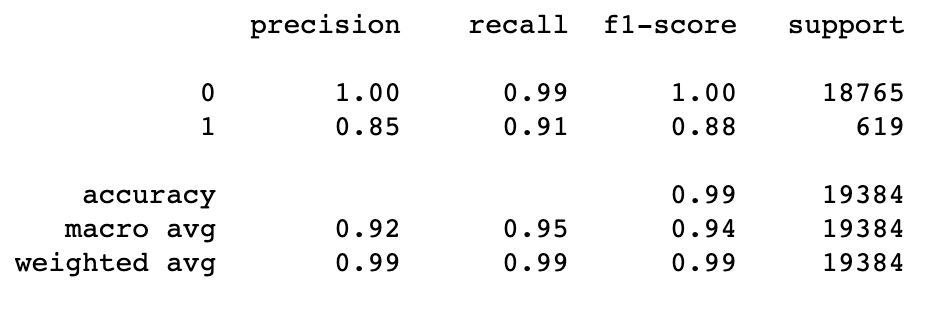
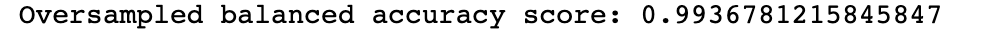
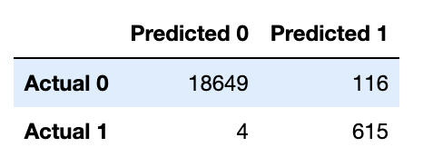
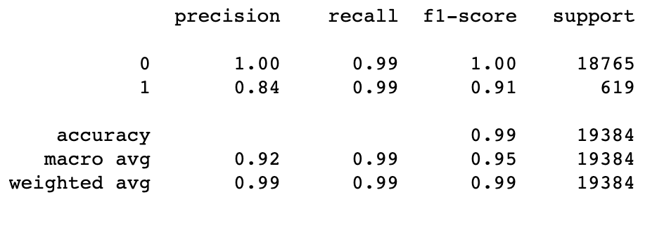

# credit-risk-classification

## Overview of the Analysis

* The purpose of this analysis was to use existing credit risk information to create a model that would predict credit risk for potential loan applicants.
* The data provided financial information about each borrower. The Y value was set at "loan status" which had a value of either 0 or 1. The X values were loan size	, interest rate, 	borrower income,	debt to income ratio, 	number of accounts,	derogatory marks and	total debt.
* In the machine learning models, I first used logistic regression to predict the "loan status". In order to do this, I split the data frame into the aforementioned x and y variables. I then performed a train-test-split on the data in ordder to train and then test the model. I used the fitted model to predict loan status of either 0 or 1. In order to test the acuracy of the model, I used s balanced accuracy score,  a confusion matrix and a classification report to compare values.
* For the second model, I first oversampled the data because it was unbalanced, in this case it had a much higher number of 0's compared to 1's. I then followed the same method used in the first model to predict and then test, this time using the resampled data.

## Results

* Machine Learning Model 1:

* Machine Learning Model 2:

## Summary

* The oversampled model performs best. When looking at the recall, which is 88% in the first model and 91% in the second model, we see that the oversampled model is caputuring a higher amount of correctly predicted 1's. 
* In the case of this credit risk classification, performance is mostly based on the models ability for accurately predict the 1's. Borrowers labeled as 1 are high-risk, indicating that the chance the loan will not be repaid or that the borrower defaults is high. If the borrowers are inaccurately predicted as low-risk (0) when they are actually high-risk, the lending agency may suffer great finanical loss.

Although the oversampled model performed better, it would still need further considerations of the problem in order to select it as a recommended model.
